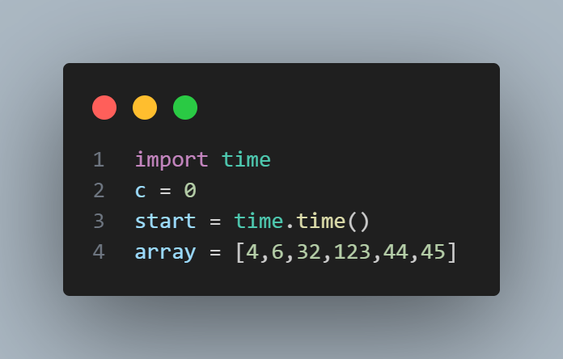

# INTEGRANTES :
- Facundo Maidana
- Valentino Mendive
- Gianlucca Iacona

## Python

## 1.  indicando paso a paso qué hace el algoritmo

Se llama a la funcion quicksort que otorga los valores minimos y maximos de la funcion dada, este dentro compara si el minimo es menor a el maximo, dentro llama a la funcion particionar la cual separa los numeros a la mitad dejando los numeros mas bajos que el ultimo numero de la lista de un lado y a los mayores a el ultimo numero de la lista de el otro, esta lo hace usando la funcion Swap que intercambia estos numeros. luego esta funcion se llama a si misma entregando los valores divididos de esta, de un lado y los valores dividos de el otro.
esta termina cuando los valores mas bajos y los mas altos no sean mas altos o mas bajos sino iguales.

## 2. ¿Se les ocurre alguna forma de implementar el algoritmo sin utilizar recursión?

Se nos ocurre ordenarlo con el metodo Bubble ya que esta tambien podria ordenar una lista de este tipo.

## 3.¿Notan diferencias en cuanto a performance? ¿Cuáles?

Notamos una diferencia en la rapidez en la que se ejecuta el programa y con su eficacia ya que separa la lista en dos para no tener que pasar nuevamente sobre todos los numeros demasiadas veces a diferencia de el formato bubble.

# Explicacion de el codigo

- importamos el Time
 se inicializa C en 0 para contar las veces que los numeros son comparados durante el proceso de ordenamiento.
 inicia el tiempo de proceso.
 con la variable array establecimos numeros aleatorios para luego ordenarlos

- creamos la funcion Swap para intercambiar numeros de posicion

- creamos un for donde el minimo sea 0 y el limite el ultimo numero de el array.
- dentro creamos otro for donde el minimo sea la i de el anterior for y su maximo la lista.
- dentro de el for se suma uno al contador de c.
- dentro de el for se hace un if que verifica que la lista en i sea mayor a la lista en j.
- dentro de el if se intercambian los numeros con la funcion swap
 esto se repite una y otra vez hasta que los numeros esten ordenados de menor a mayor

- se detiene el tiempo 
- printeoss

# Respuestas
- El algoritmo bubble se destaca por ser eficaz en procesos de ordenamientos en listas mas reducidas debido a su poco codeo. en cambio el algoritmo quicksort ordena listas mayores de manera mas eficaz utilizando mas lineas de codigo.

- El algoritmo quicksort tiene de ventaja su menor tiempo de ejecucion y de comparaciones pero mayor codeo.

- El algortitmo de bubble tiene de ventaja su menor codeo pero el numero de comparaciones es mucho mayor a el algoritmo quicksort y evidente mayor tiempo de ejecucion. 
